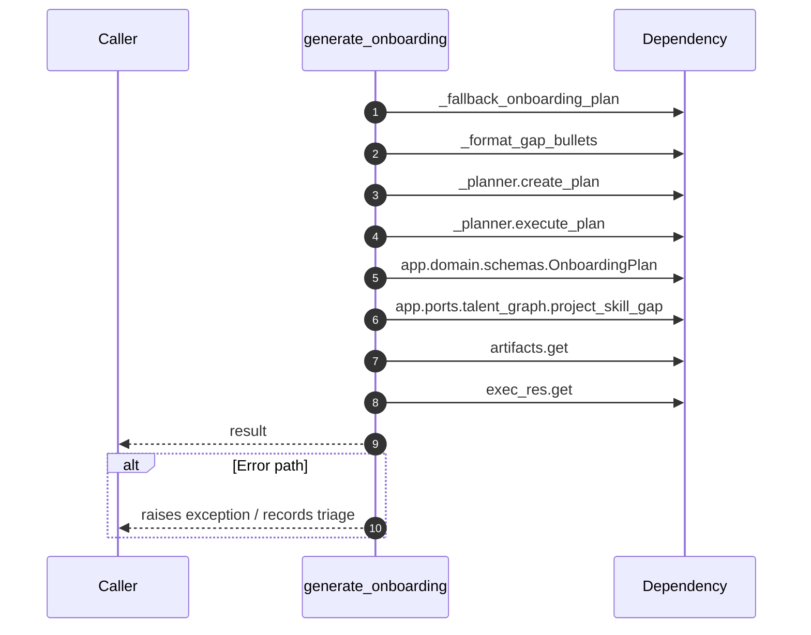

# Internal flow — `app.application.onboarding_service.generate_onboarding`

- Module: `app.application.onboarding_service`
- Source: [app.application.onboarding_service.generate_onboarding](../Src/backend/app/application/onboarding_service.py#L20)
- Summary: Create an onboarding plan by merging planner output with graph-derived gaps.

