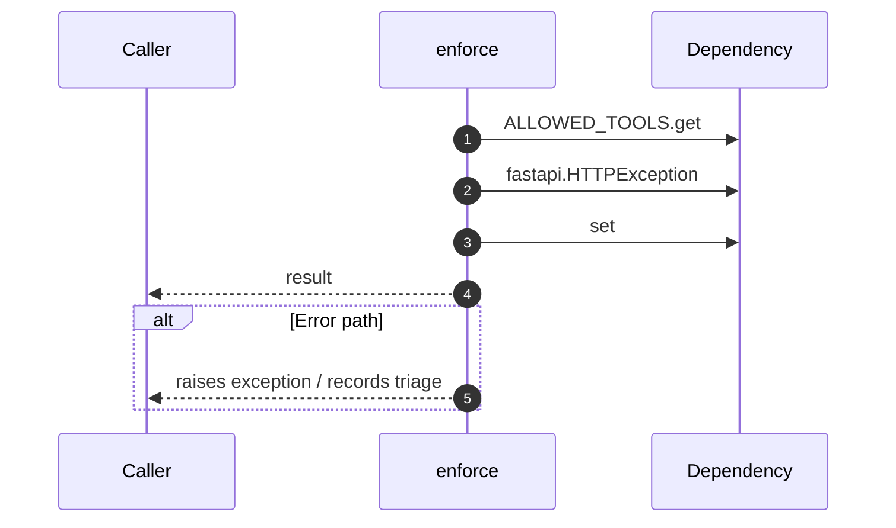

# Internal flow — `app.application.policy_bus.enforce`

- Module: `app.application.policy_bus`
- Source: [app.application.policy_bus.enforce](../Src/backend/app/application/policy_bus.py#L44)
- Summary: Ensure *role* can execute *tool*; raise ``HTTPException`` otherwise.

