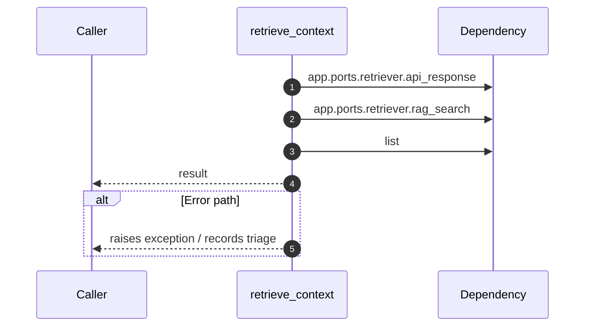

# Internal flow — `app.application.retrieval_service.retrieve_context`

- Module: `app.application.retrieval_service`
- Source: [app.application.retrieval_service.retrieve_context](../Src/backend/app/application/retrieval_service.py#L11)
- Summary: Run the configured retriever and normalise its response.

