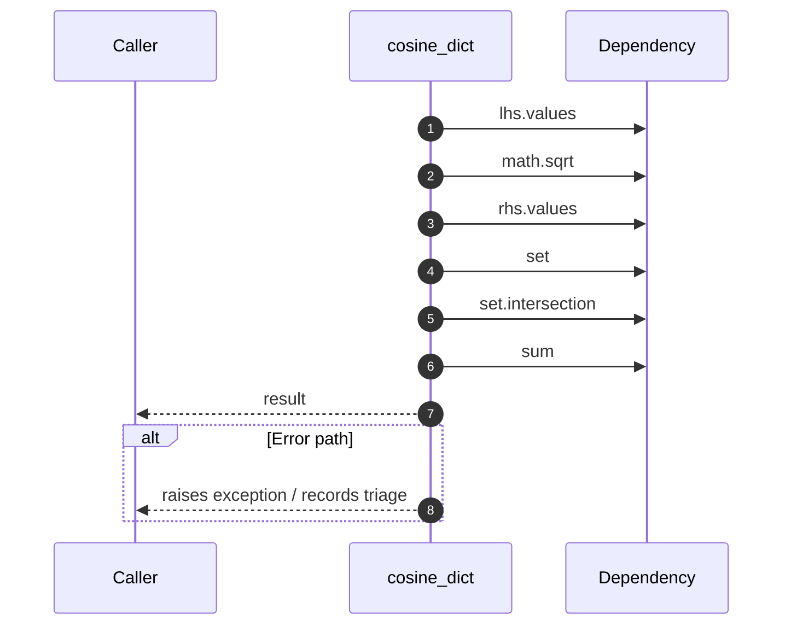

# Internal flow — `app.application.staffing_service.cosine_dict`

- Module: `app.application.staffing_service`
- Source: [app.application.staffing_service.cosine_dict](../Src/backend/app/application/staffing_service.py#L17)
- Summary: Compute cosine similarity between two sparse vectors represented as dicts.

