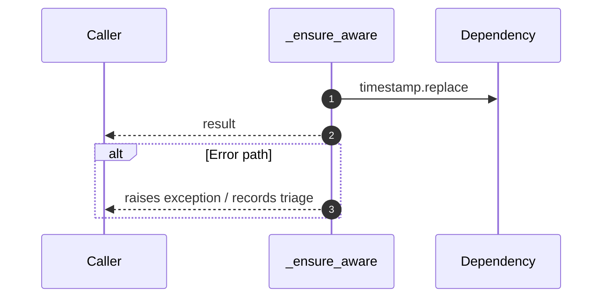

# Internal flow — `app.application.staffing_service._ensure_aware`

- Module: `app.application.staffing_service`
- Source: [app.application.staffing_service._ensure_aware](../Src/backend/app/application/staffing_service.py#L32)

