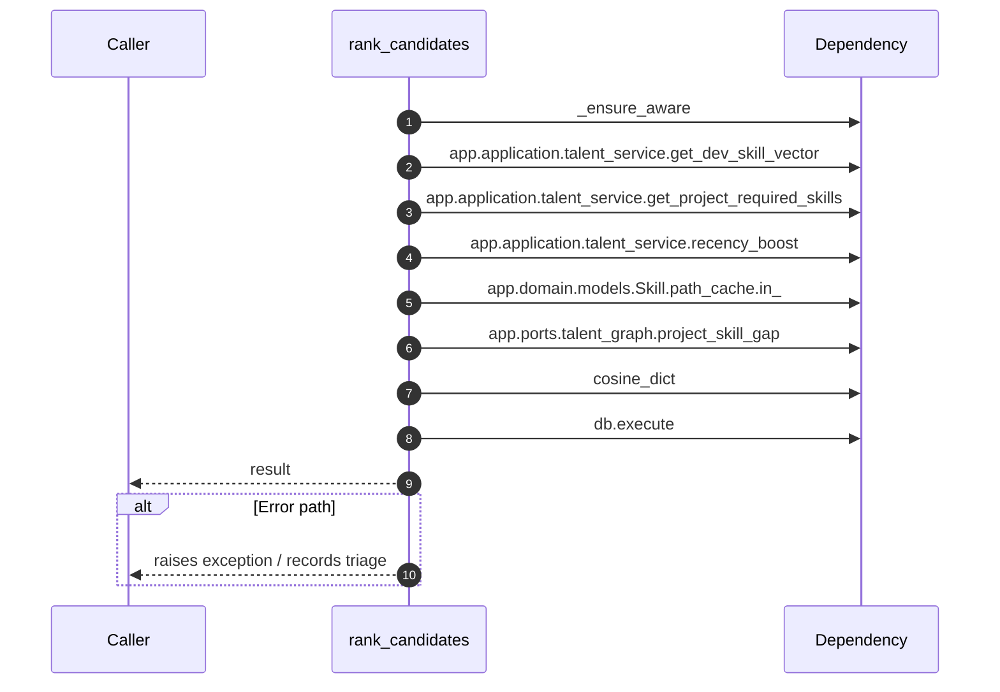

# Internal flow — `app.application.staffing_service.rank_candidates`

- Module: `app.application.staffing_service`
- Source: [app.application.staffing_service.rank_candidates](../Src/backend/app/application/staffing_service.py#L38)
- Summary: Return ranked candidate dictionaries for the requested project.

