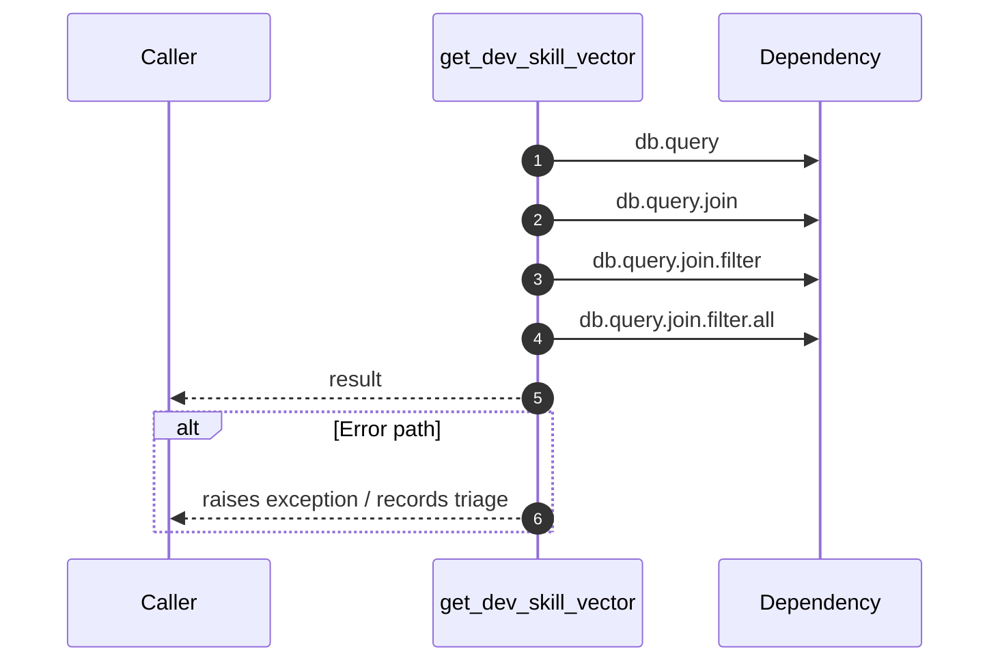

# Internal flow — `app.application.talent_service.get_dev_skill_vector`

- Module: `app.application.talent_service`
- Source: [app.application.talent_service.get_dev_skill_vector](../Src/backend/app/application/talent_service.py#L27)
- Summary: Return a mapping of skill path to score for a developer.

