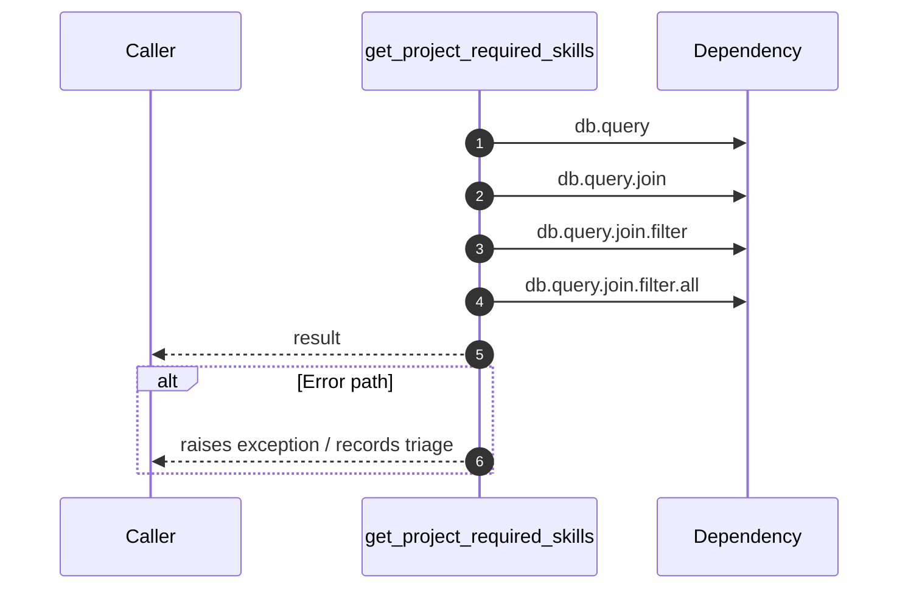

# Internal flow — `app.application.talent_service.get_project_required_skills`

- Module: `app.application.talent_service`
- Source: [app.application.talent_service.get_project_required_skills](../Src/backend/app/application/talent_service.py#L39)
- Summary: Return required skills for a project keyed by skill path.

