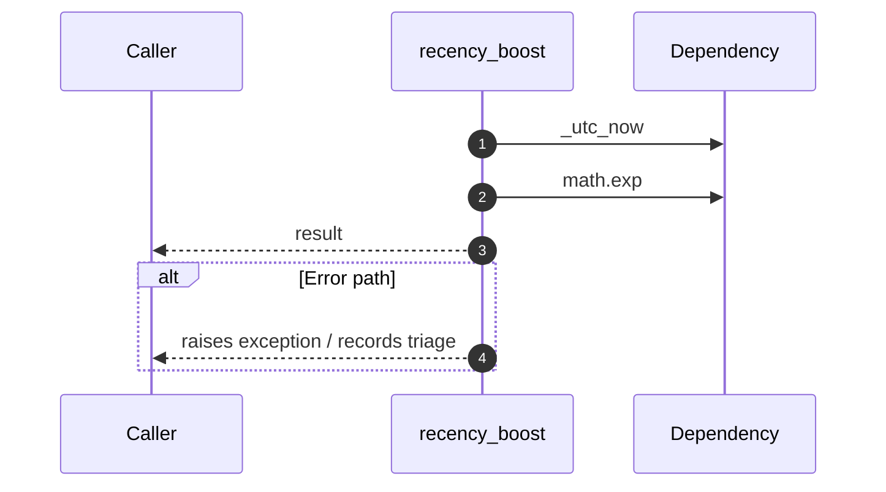

# Internal flow — `app.application.talent_service.recency_boost`

- Module: `app.application.talent_service`
- Source: [app.application.talent_service.recency_boost](../Src/backend/app/application/talent_service.py#L18)
- Summary: Return a decay score between 0.5 and 1.0 based on recency.

