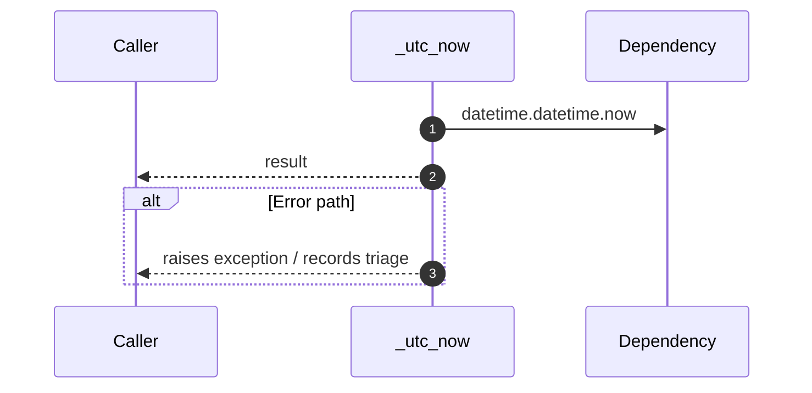

# Internal flow — `app.application.talent_service._utc_now`

- Module: `app.application.talent_service`
- Source: [app.application.talent_service._utc_now](../Src/backend/app/application/talent_service.py#L14)

