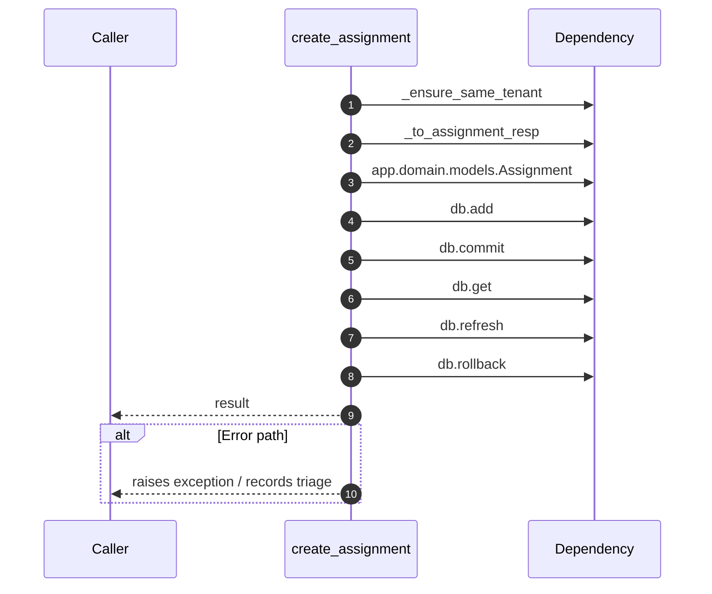

# Internal flow — `app.ports.assignments.create_assignment`

- Module: `app.ports.assignments`
- Source: [app.ports.assignments.create_assignment](../Src/backend/app/ports/assignments.py#L32)
- Summary: Create a new assignment ensuring tenant coherence.

