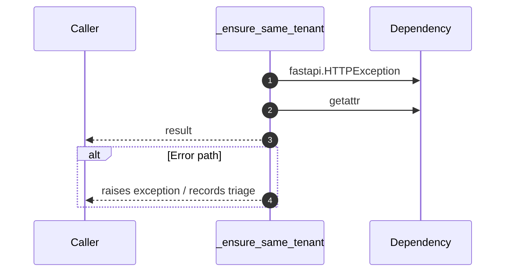

# Internal flow — `app.ports.assignments._ensure_same_tenant`

- Module: `app.ports.assignments`
- Source: [app.ports.assignments._ensure_same_tenant](../Src/backend/app/ports/assignments.py#L16)

```mermaid
sequenceDiagram
    autonumber
    participant Caller
    participant Target as _ensure_same_tenant
    Target->>Dependency: fastapi.HTTPException
    Target->>Dependency: getattr
    Target-->>Caller: result
    alt Error path
        Target-->>Caller: raises exception / records triage
    end
```