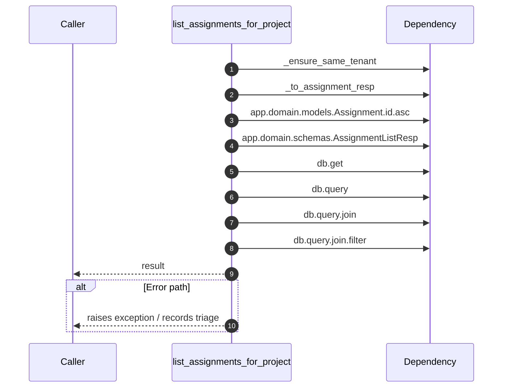

# Internal flow — `app.ports.assignments.list_assignments_for_project`

- Module: `app.ports.assignments`
- Source: [app.ports.assignments.list_assignments_for_project](../Src/backend/app/ports/assignments.py#L94)
- Summary: List assignments for the supplied project within the tenant.

