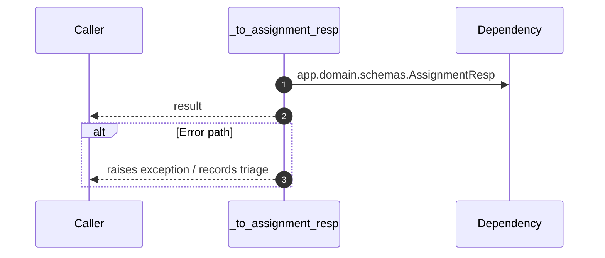

# Internal flow — `app.ports.assignments._to_assignment_resp`

- Module: `app.ports.assignments`
- Source: [app.ports.assignments._to_assignment_resp](../Src/backend/app/ports/assignments.py#L22)

```mermaid
sequenceDiagram
    autonumber
    participant Caller
    participant Target as _to_assignment_resp
    Target->>Dependency: app.domain.schemas.AssignmentResp
    Target-->>Caller: result
    alt Error path
        Target-->>Caller: raises exception / records triage
    end
```