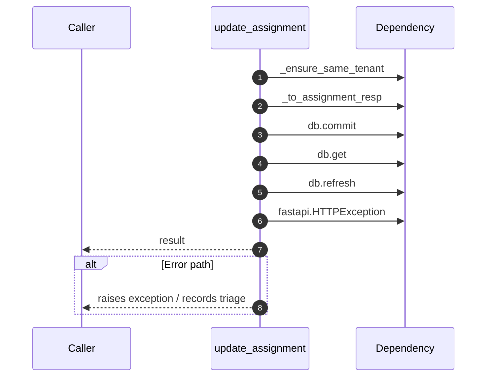

# Internal flow — `app.ports.assignments.update_assignment`

- Module: `app.ports.assignments`
- Source: [app.ports.assignments.update_assignment](../Src/backend/app/ports/assignments.py#L63)
- Summary: Update fields on an assignment while enforcing tenant boundaries.

