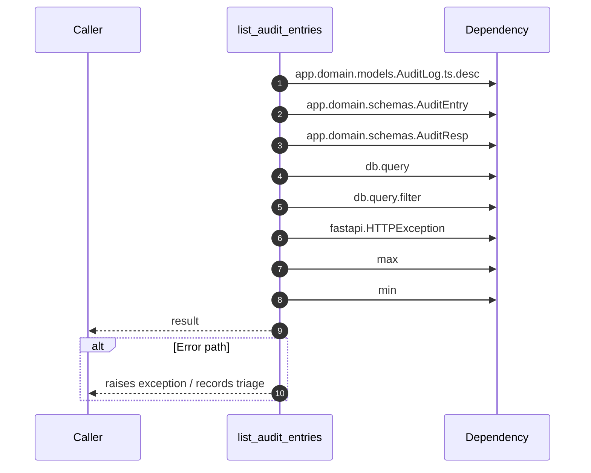

# Internal flow — `app.ports.audit.list_audit_entries`

- Module: `app.ports.audit`
- Source: [app.ports.audit.list_audit_entries](../Src/backend/app/ports/audit.py#L14)
- Summary: Return recent audit entries for the caller's tenant.

