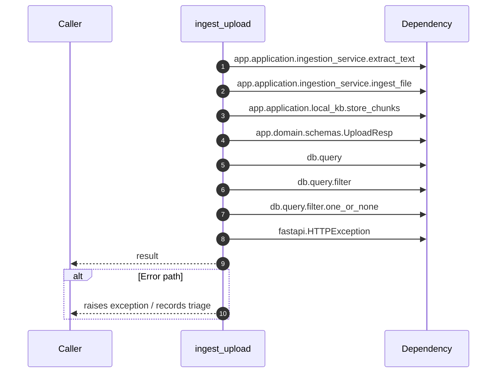

# Internal flow — `app.ports.ingestion.ingest_upload`

- Module: `app.ports.ingestion`
- Source: [app.ports.ingestion.ingest_upload](../Src/backend/app/ports/ingestion.py#L16)
- Summary: Ingest a document for the caller's tenant and return upload stats.

