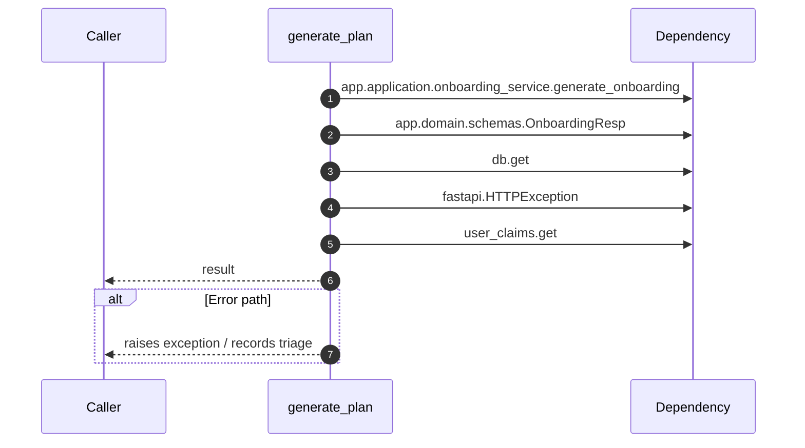

# Internal flow — `app.ports.onboarding.generate_plan`

- Module: `app.ports.onboarding`
- Source: [app.ports.onboarding.generate_plan](../Src/backend/app/ports/onboarding.py#L16)
- Summary: Generate an onboarding plan within tenant boundaries.

