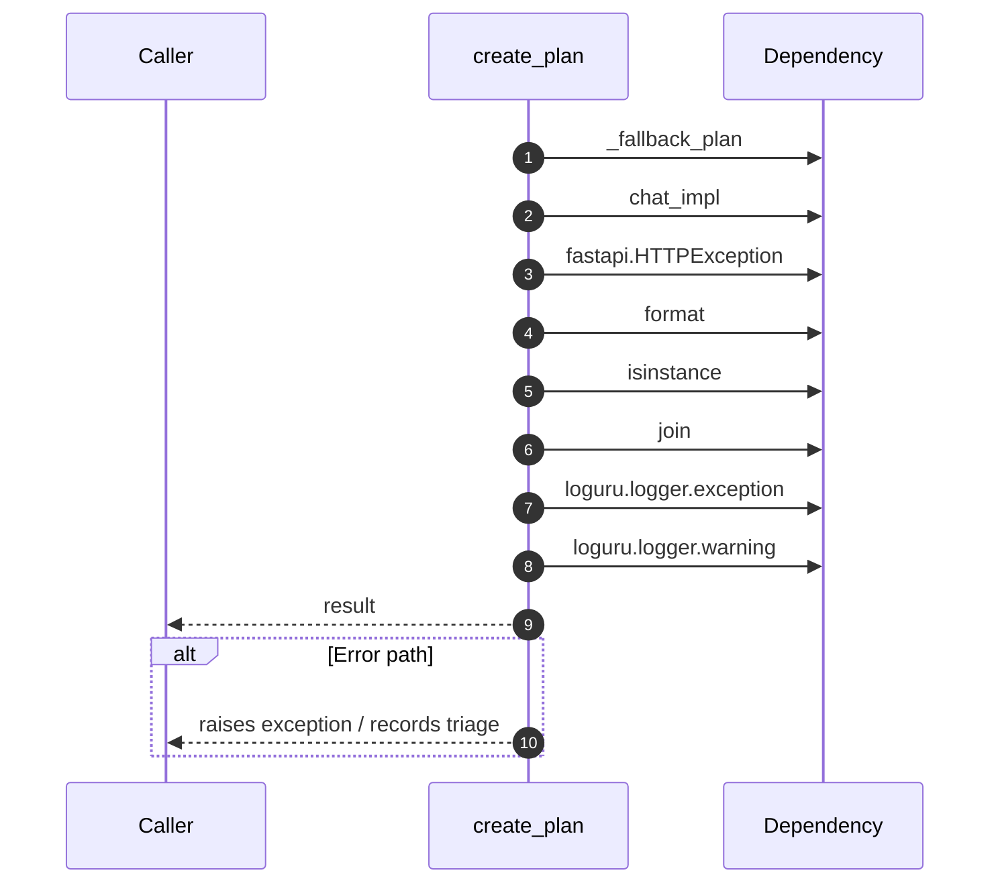

# Internal flow — `app.ports.planner.create_plan`

- Module: `app.ports.planner`
- Source: [app.ports.planner.create_plan](../Src/backend/app/ports/planner.py#L55)
- Summary: Call the planner LLM and return the generated plan payload.

