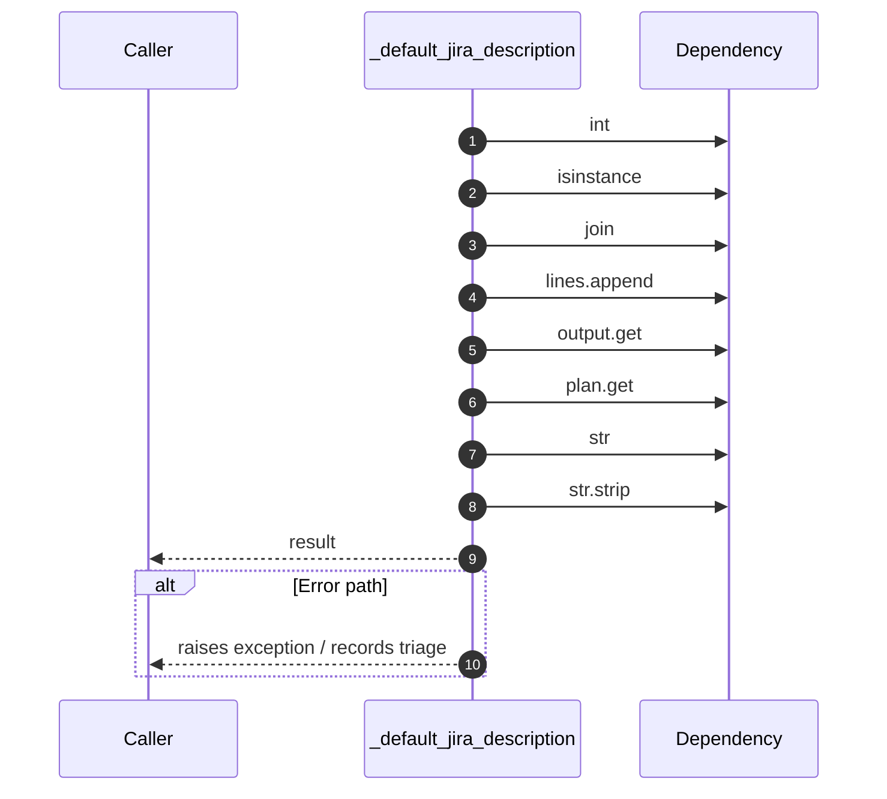

# Internal flow — `app.ports.planner._default_jira_description`

- Module: `app.ports.planner`
- Source: [app.ports.planner._default_jira_description](../Src/backend/app/ports/planner.py#L172)

```mermaid
sequenceDiagram
    autonumber
    participant Caller
    participant Target as _default_jira_description
    Target->>Dependency: int
    Target->>Dependency: isinstance
    Target->>Dependency: join
    Target->>Dependency: lines.append
    Target->>Dependency: output.get
    Target->>Dependency: plan.get
    Target->>Dependency: str
    Target->>Dependency: str.strip
    Target-->>Caller: result
    alt Error path
        Target-->>Caller: raises exception / records triage
    end
```