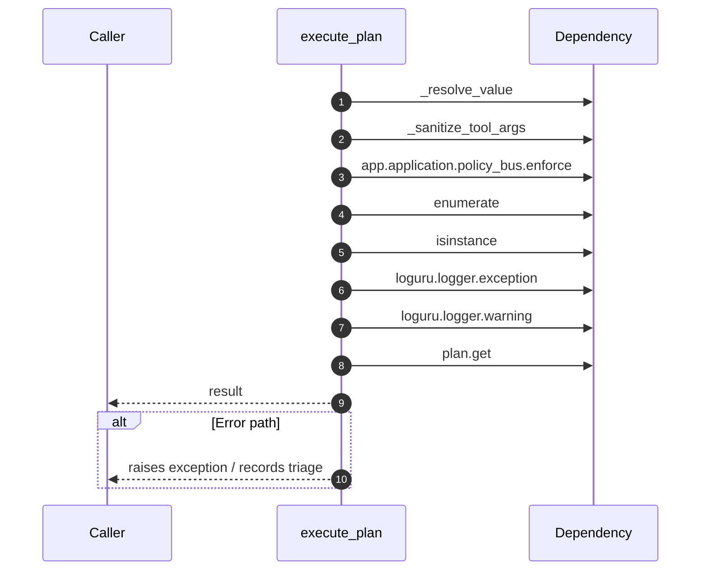

# Internal flow — `app.ports.planner.execute_plan`

- Module: `app.ports.planner`
- Source: [app.ports.planner.execute_plan](../Src/backend/app/ports/planner.py#L520)
- Summary: Execute a plan against registered tools while enforcing RBAC.

