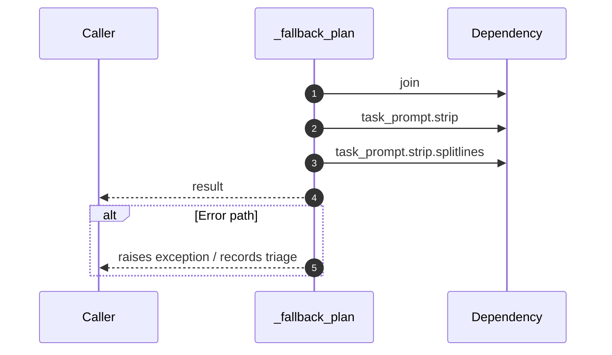

# Internal flow — `app.ports.planner._fallback_plan`

- Module: `app.ports.planner`
- Source: [app.ports.planner._fallback_plan](../Src/backend/app/ports/planner.py#L93)
- Summary: Generate a deterministic plan when the planner service is unavailable.

