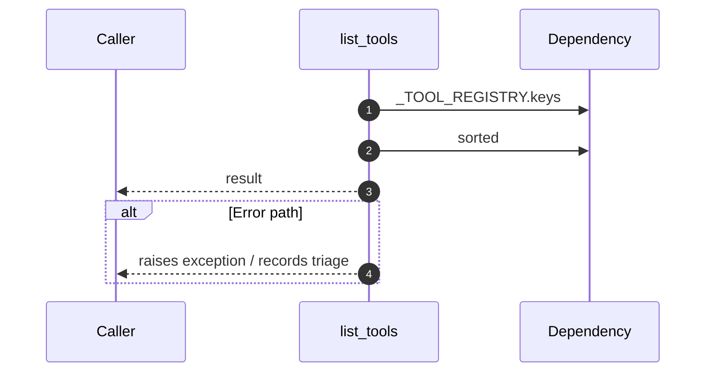

# Internal flow — `app.ports.planner.list_tools`

- Module: `app.ports.planner`
- Source: [app.ports.planner.list_tools](../Src/backend/app/ports/planner.py#L29)
- Summary: Return registered tool names sorted alphabetically.

