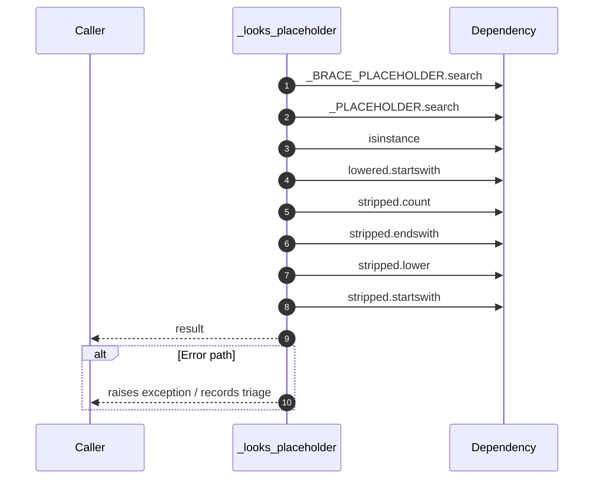

# Internal flow — `app.ports.planner._looks_placeholder`

- Module: `app.ports.planner`
- Source: [app.ports.planner._looks_placeholder](../Src/backend/app/ports/planner.py#L261)

```mermaid
sequenceDiagram
    autonumber
    participant Caller
    participant Target as _looks_placeholder
    Target->>Dependency: _BRACE_PLACEHOLDER.search
    Target->>Dependency: _PLACEHOLDER.search
    Target->>Dependency: isinstance
    Target->>Dependency: lowered.startswith
    Target->>Dependency: stripped.count
    Target->>Dependency: stripped.endswith
    Target->>Dependency: stripped.lower
    Target->>Dependency: stripped.startswith
    Target-->>Caller: result
    alt Error path
        Target-->>Caller: raises exception / records triage
    end
```