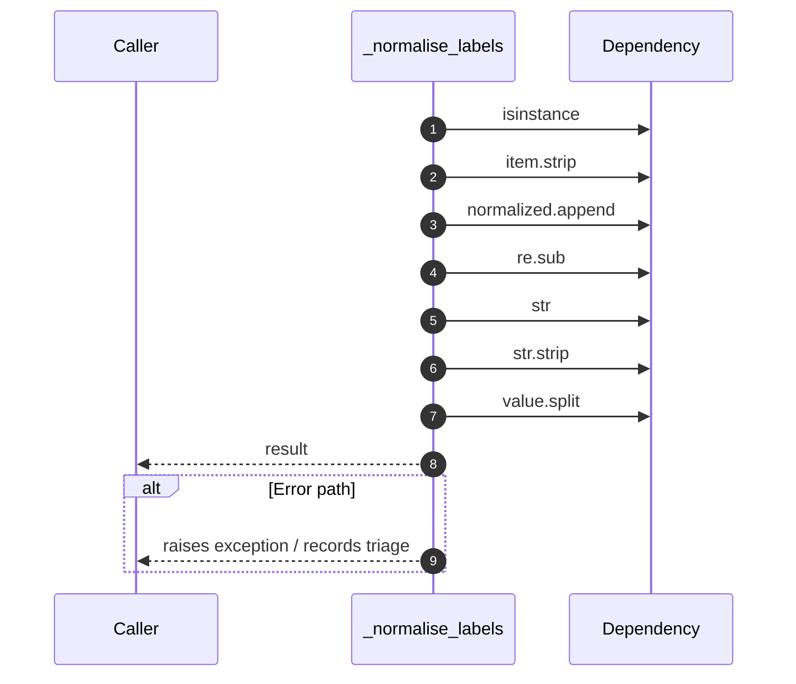

# Internal flow — `app.ports.planner._normalise_labels`

- Module: `app.ports.planner`
- Source: [app.ports.planner._normalise_labels](../Src/backend/app/ports/planner.py#L212)

```mermaid
sequenceDiagram
    autonumber
    participant Caller
    participant Target as _normalise_labels
    Target->>Dependency: isinstance
    Target->>Dependency: item.strip
    Target->>Dependency: normalized.append
    Target->>Dependency: re.sub
    Target->>Dependency: str
    Target->>Dependency: str.strip
    Target->>Dependency: value.split
    Target-->>Caller: result
    alt Error path
        Target-->>Caller: raises exception / records triage
    end
```