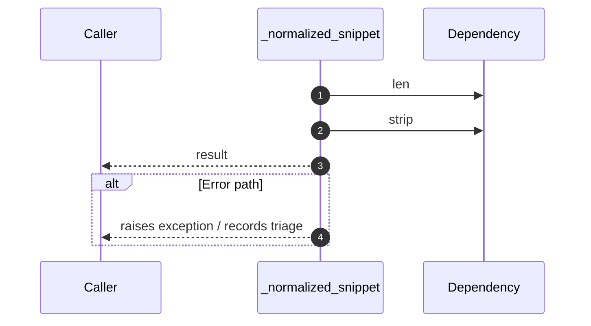

# Internal flow — `app.ports.planner._normalized_snippet`

- Module: `app.ports.planner`
- Source: [app.ports.planner._normalized_snippet](../Src/backend/app/ports/planner.py#L252)

```mermaid
sequenceDiagram
    autonumber
    participant Caller
    participant Target as _normalized_snippet
    Target->>Dependency: len
    Target->>Dependency: strip
    Target-->>Caller: result
    alt Error path
        Target-->>Caller: raises exception / records triage
    end
```