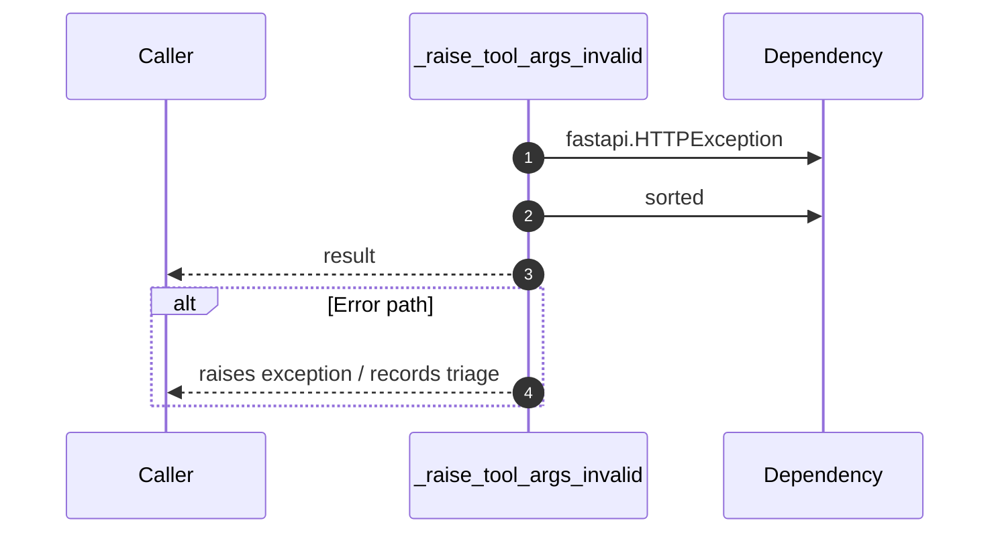

# Internal flow — `app.ports.planner._raise_tool_args_invalid`

- Module: `app.ports.planner`
- Source: [app.ports.planner._raise_tool_args_invalid](../Src/backend/app/ports/planner.py#L123)

```mermaid
sequenceDiagram
    autonumber
    participant Caller
    participant Target as _raise_tool_args_invalid
    Target->>Dependency: fastapi.HTTPException
    Target->>Dependency: sorted
    Target-->>Caller: result
    alt Error path
        Target-->>Caller: raises exception / records triage
    end
```