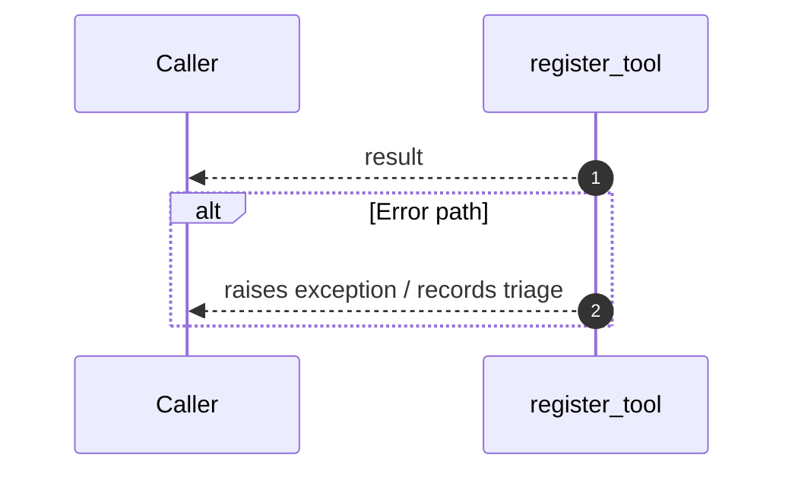

# Internal flow — `app.ports.planner.register_tool`

- Module: `app.ports.planner`
- Source: [app.ports.planner.register_tool](../Src/backend/app/ports/planner.py#L24)
- Summary: Register a callable for planner execution under *name*.

