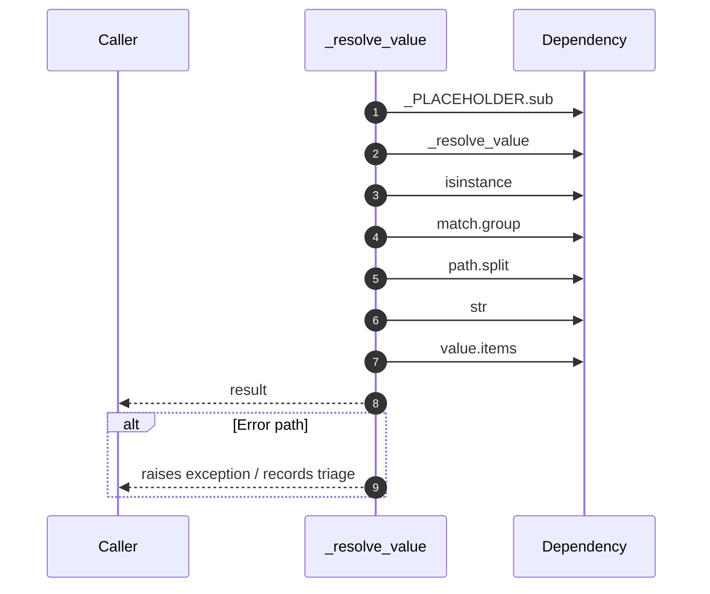

# Internal flow — `app.ports.planner._resolve_value`

- Module: `app.ports.planner`
- Source: [app.ports.planner._resolve_value](../Src/backend/app/ports/planner.py#L229)
- Summary: Recursively resolve templated placeholders from the execution context.

