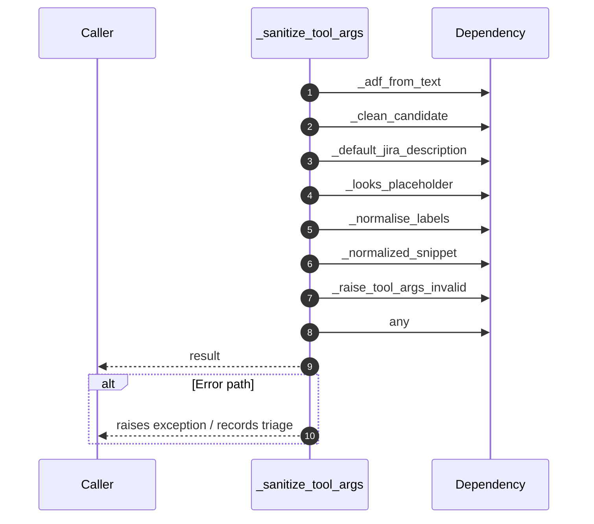

# Internal flow — `app.ports.planner._sanitize_tool_args`

- Module: `app.ports.planner`
- Source: [app.ports.planner._sanitize_tool_args](../Src/backend/app/ports/planner.py#L288)

```mermaid
sequenceDiagram
    autonumber
    participant Caller
    participant Target as _sanitize_tool_args
    Target->>Dependency: _adf_from_text
    Target->>Dependency: _clean_candidate
    Target->>Dependency: _default_jira_description
    Target->>Dependency: _looks_placeholder
    Target->>Dependency: _normalise_labels
    Target->>Dependency: _normalized_snippet
    Target->>Dependency: _raise_tool_args_invalid
    Target->>Dependency: any
    Target-->>Caller: result
    alt Error path
        Target-->>Caller: raises exception / records triage
    end
```