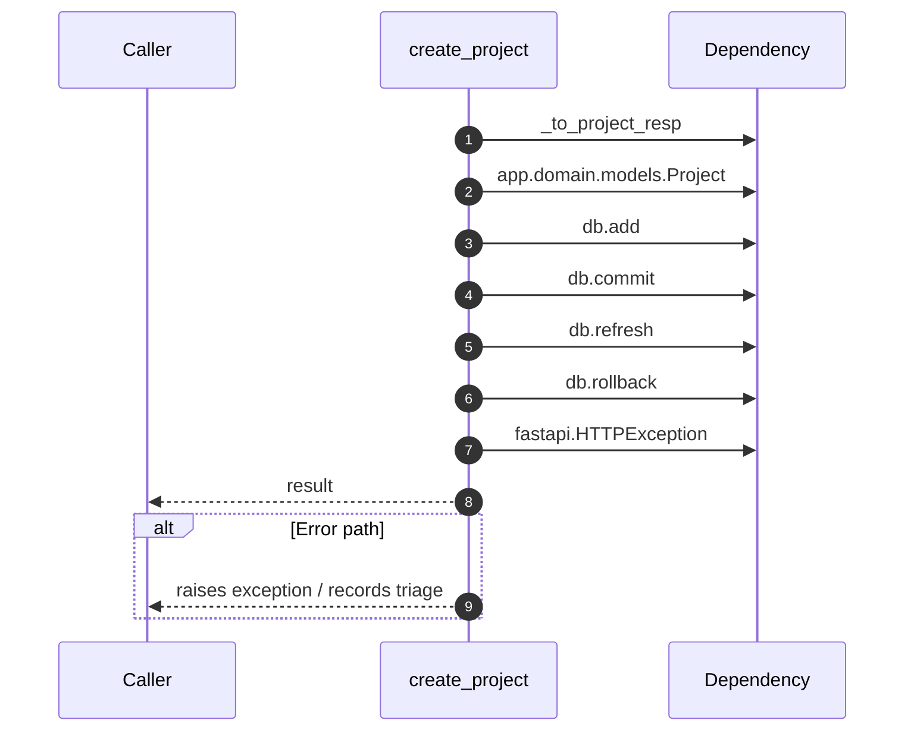

# Internal flow — `app.ports.projects.create_project`

- Module: `app.ports.projects`
- Source: [app.ports.projects.create_project](../Src/backend/app/ports/projects.py#L24)
- Summary: Create a new project scoped to *tenant_id* and return its schema.

