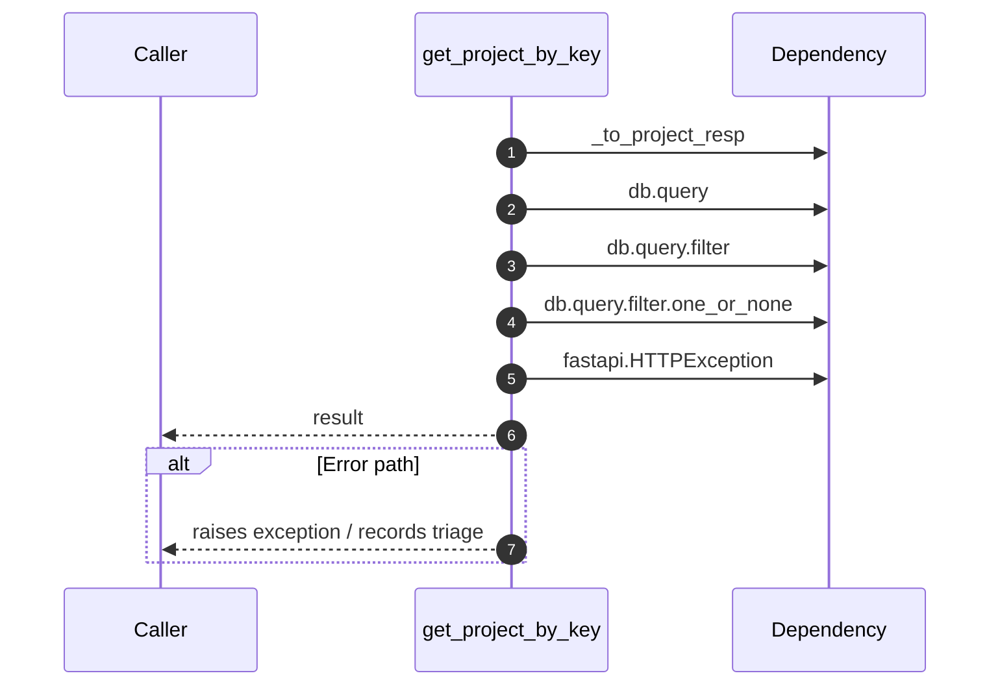

# Internal flow — `app.ports.projects.get_project_by_key`

- Module: `app.ports.projects`
- Source: [app.ports.projects.get_project_by_key](../Src/backend/app/ports/projects.py#L46)
- Summary: Return a single project by key within the caller's tenant.

