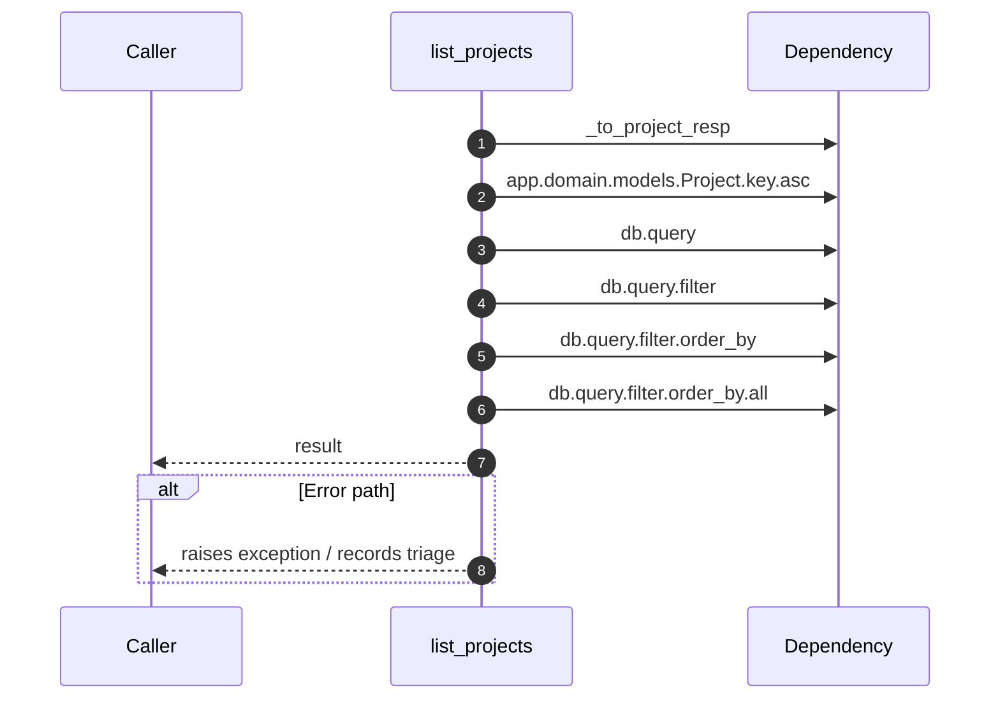

# Internal flow — `app.ports.projects.list_projects`

- Module: `app.ports.projects`
- Source: [app.ports.projects.list_projects](../Src/backend/app/ports/projects.py#L59)
- Summary: Return all projects for the provided tenant ordered by key.

