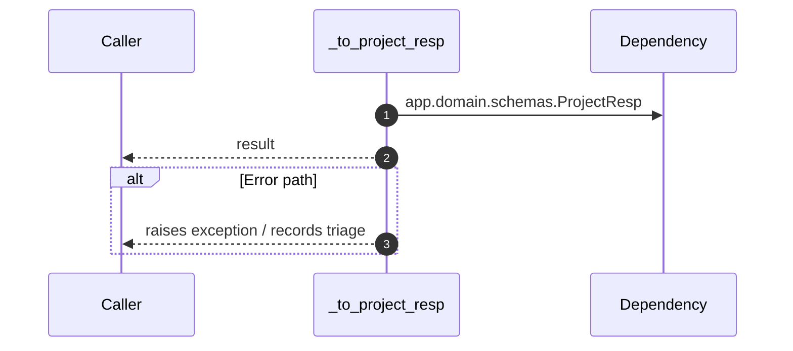

# Internal flow — `app.ports.projects._to_project_resp`

- Module: `app.ports.projects`
- Source: [app.ports.projects._to_project_resp](../Src/backend/app/ports/projects.py#L15)

```mermaid
sequenceDiagram
    autonumber
    participant Caller
    participant Target as _to_project_resp
    Target->>Dependency: app.domain.schemas.ProjectResp
    Target-->>Caller: result
    alt Error path
        Target-->>Caller: raises exception / records triage
    end
```