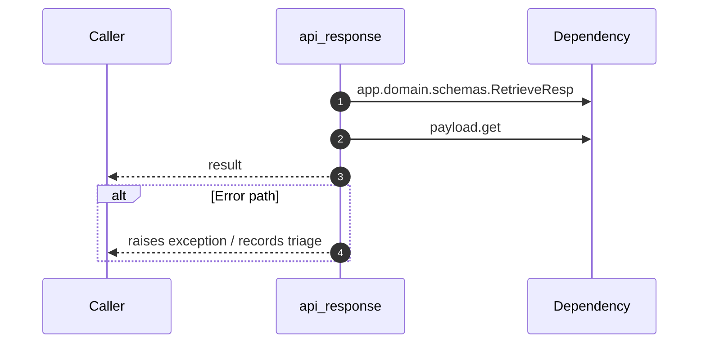

# Internal flow — `app.ports.retriever.api_response`

- Module: `app.ports.retriever`
- Source: [app.ports.retriever.api_response](../Src/backend/app/ports/retriever.py#L229)
- Summary: Coerce internal payload structure into the API response schema.

