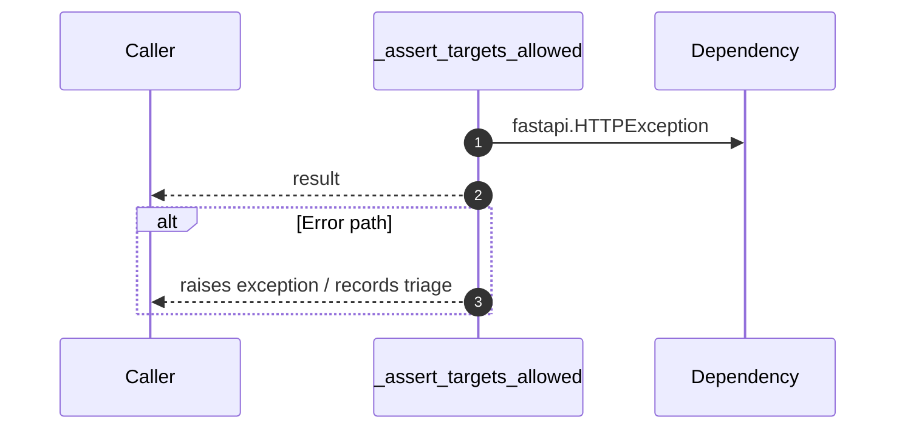

# Internal flow — `app.ports.retriever._assert_targets_allowed`

- Module: `app.ports.retriever`
- Source: [app.ports.retriever._assert_targets_allowed](../Src/backend/app/ports/retriever.py#L23)
- Summary: Ensure requested targets are within the caller's accessible projects.

