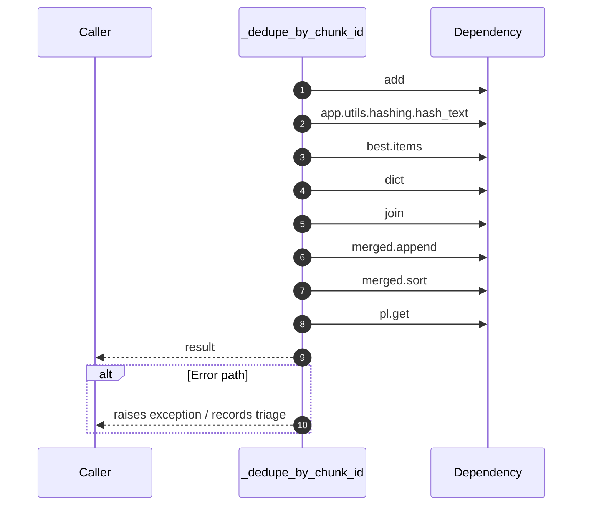

# Internal flow — `app.ports.retriever._dedupe_by_chunk_id`

- Module: `app.ports.retriever`
- Source: [app.ports.retriever._dedupe_by_chunk_id](../Src/backend/app/ports/retriever.py#L30)
- Summary: Merge duplicate chunks across collections preferring the best score.

