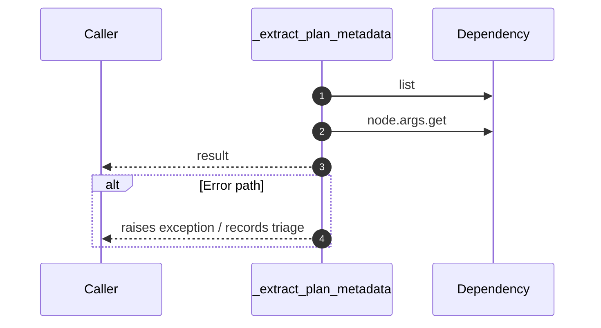

# Internal flow — `app.ports.retriever._extract_plan_metadata`

- Module: `app.ports.retriever`
- Source: [app.ports.retriever._extract_plan_metadata](../Src/backend/app/ports/retriever.py#L52)

```mermaid
sequenceDiagram
    autonumber
    participant Caller
    participant Target as _extract_plan_metadata
    Target->>Dependency: list
    Target->>Dependency: node.args.get
    Target-->>Caller: result
    alt Error path
        Target-->>Caller: raises exception / records triage
    end
```