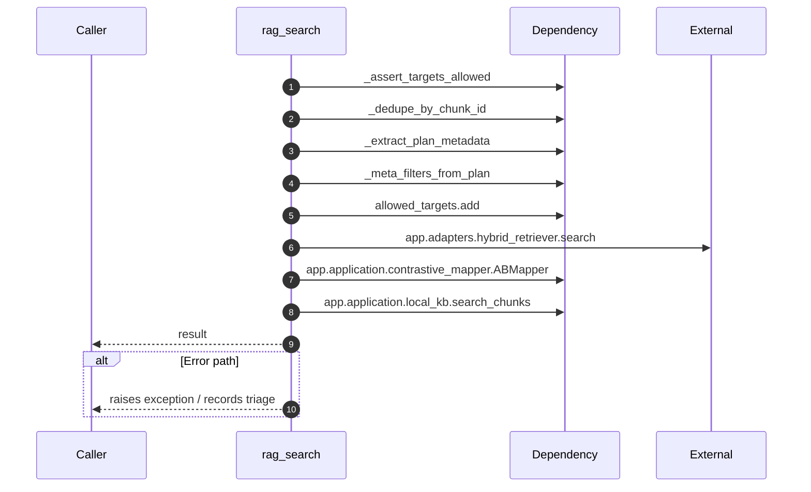

# Internal flow — `app.ports.retriever.rag_search`

- Module: `app.ports.retriever`
- Source: [app.ports.retriever.rag_search](../Src/backend/app/ports/retriever.py#L70)
- Summary: Execute the hybrid retriever and return fused payloads.

