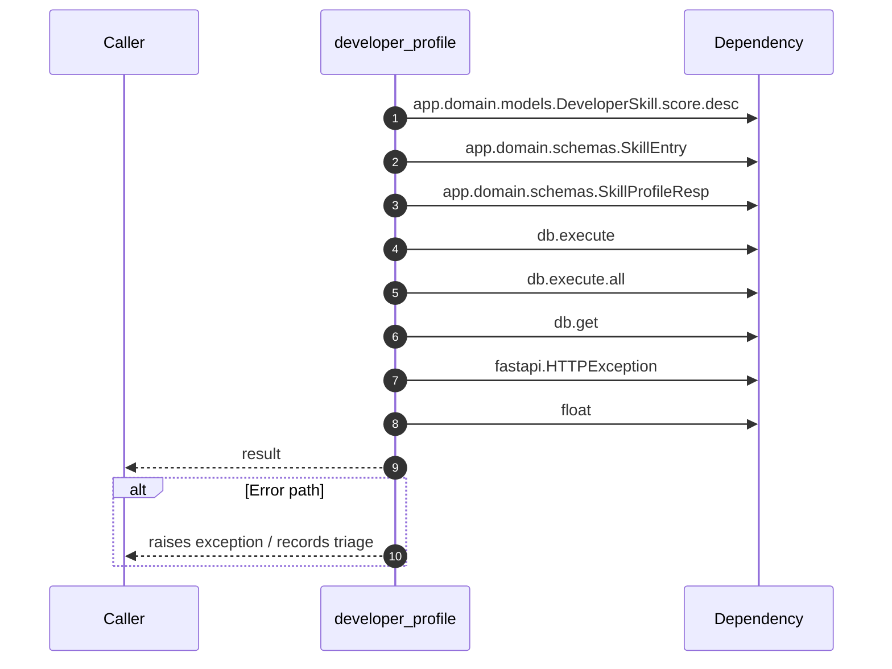

# Internal flow — `app.ports.skills.developer_profile`

- Module: `app.ports.skills`
- Source: [app.ports.skills.developer_profile](../Src/backend/app/ports/skills.py#L15)
- Summary: Return the developer skill profile within tenant boundaries.

