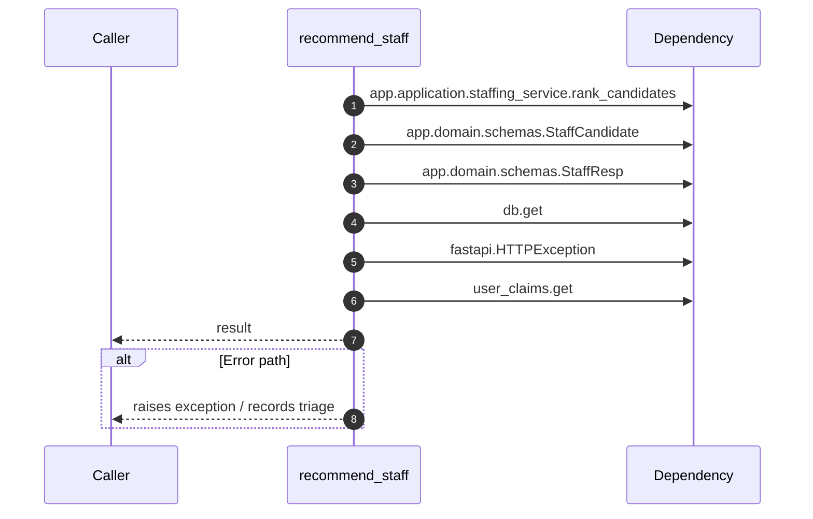

# Internal flow — `app.ports.staffing.recommend_staff`

- Module: `app.ports.staffing`
- Source: [app.ports.staffing.recommend_staff](../Src/backend/app/ports/staffing.py#L15)
- Summary: Return staffing recommendations ensuring tenant access and schema conversion.

