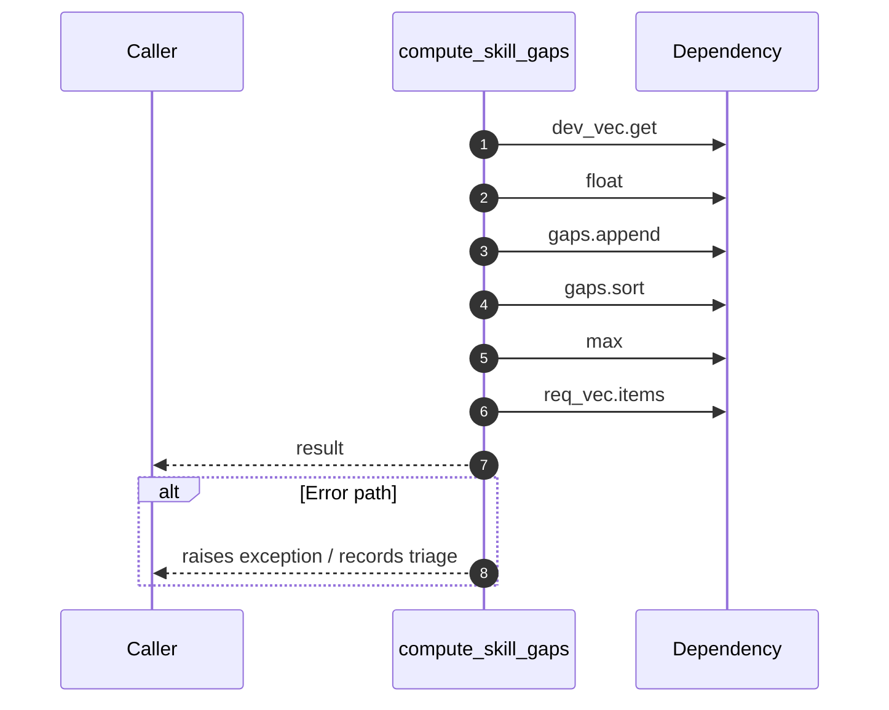

# Internal flow — `app.ports.talent_graph.compute_skill_gaps`

- Module: `app.ports.talent_graph`
- Source: [app.ports.talent_graph.compute_skill_gaps](../Src/backend/app/ports/talent_graph.py#L95)
- Summary: For each required skill, compute gap = max(0, required - current).

