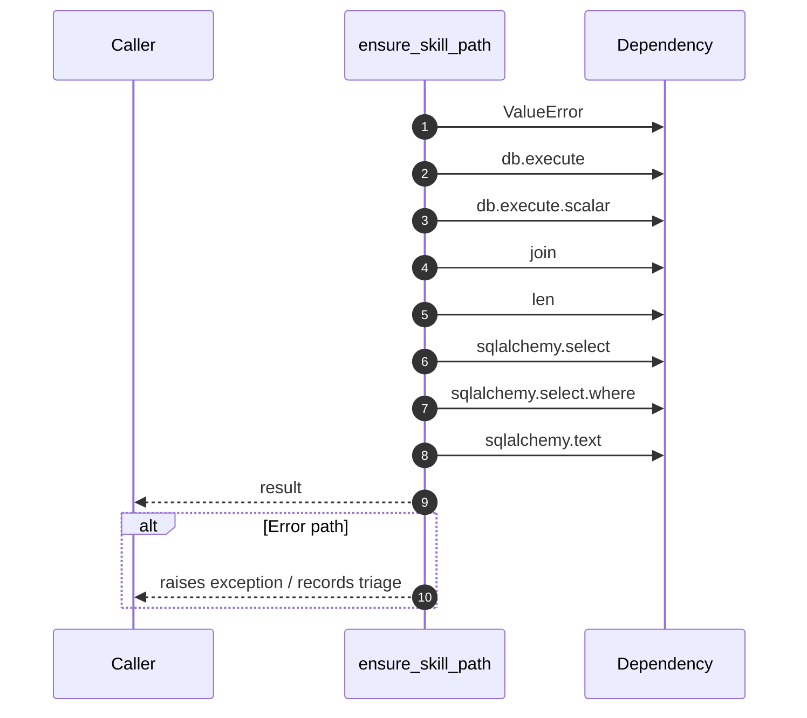

# Internal flow — `app.ports.talent_graph.ensure_skill_path`

- Module: `app.ports.talent_graph`
- Source: [app.ports.talent_graph.ensure_skill_path](../Src/backend/app/ports/talent_graph.py#L27)
- Summary: Ensure a hierarchical path exists in 'skill' table. Returns leaf skill_id.

