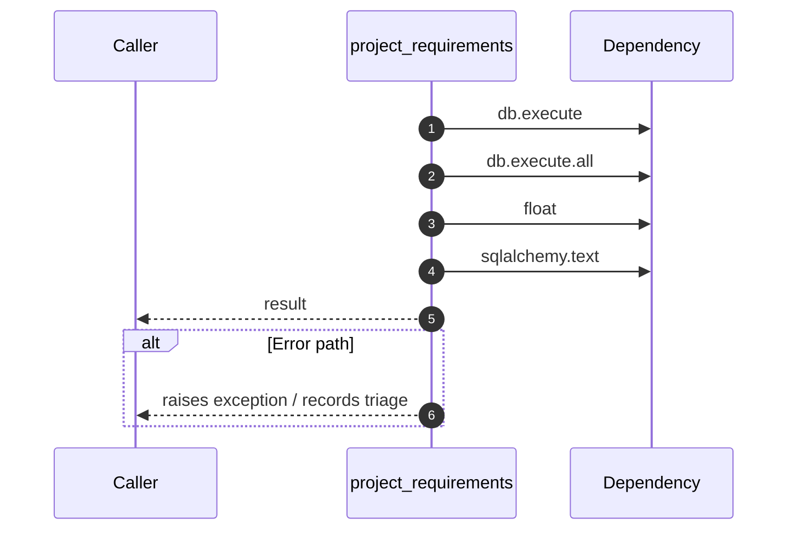

# Internal flow — `app.ports.talent_graph.project_requirements`

- Module: `app.ports.talent_graph`
- Source: [app.ports.talent_graph.project_requirements](../Src/backend/app/ports/talent_graph.py#L78)
- Summary: Returns a dict of required skills (path_cache -> importance weight).

