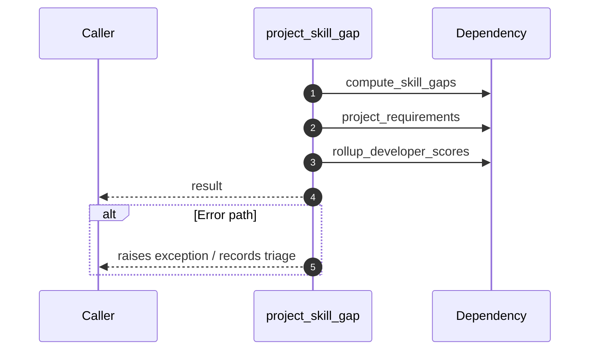

# Internal flow — `app.ports.talent_graph.project_skill_gap`

- Module: `app.ports.talent_graph`
- Source: [app.ports.talent_graph.project_skill_gap](../Src/backend/app/ports/talent_graph.py#L109)
- Summary: Convenience wrapper: compute gaps for a developer against a project's required skills.

