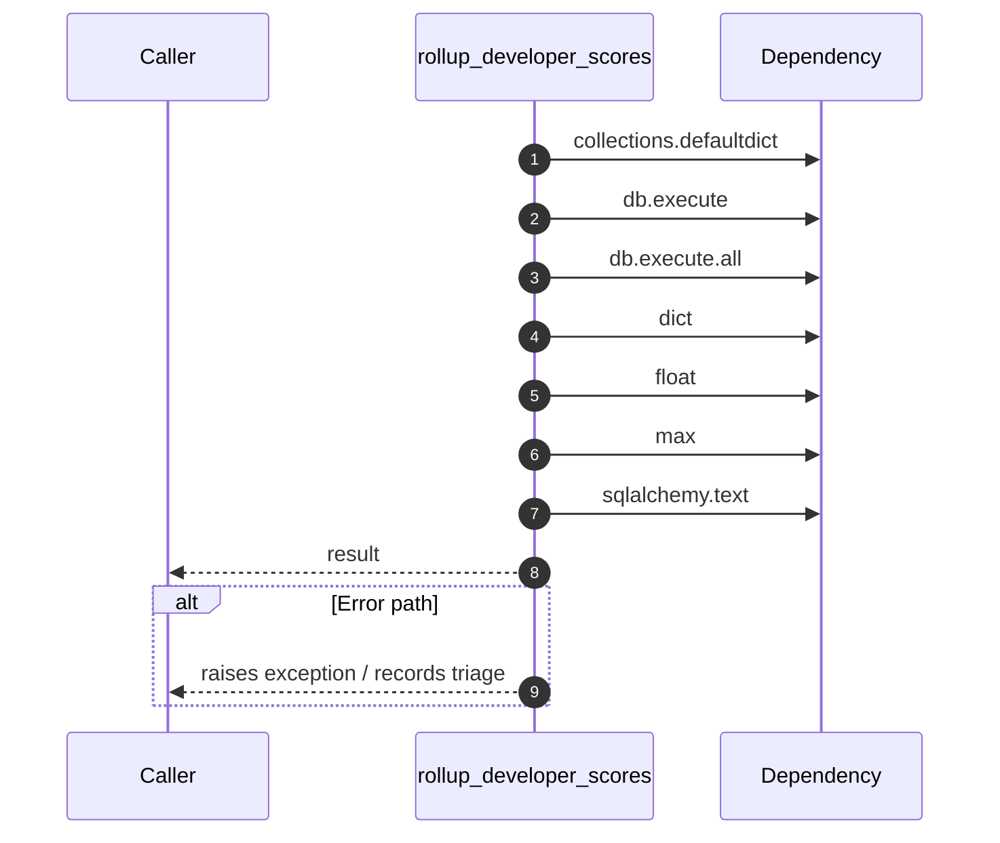

# Internal flow — `app.ports.talent_graph.rollup_developer_scores`

- Module: `app.ports.talent_graph`
- Source: [app.ports.talent_graph.rollup_developer_scores](../Src/backend/app/ports/talent_graph.py#L58)
- Summary: Collapses developer_skill rows into a dict keyed by path_cache with max score.

