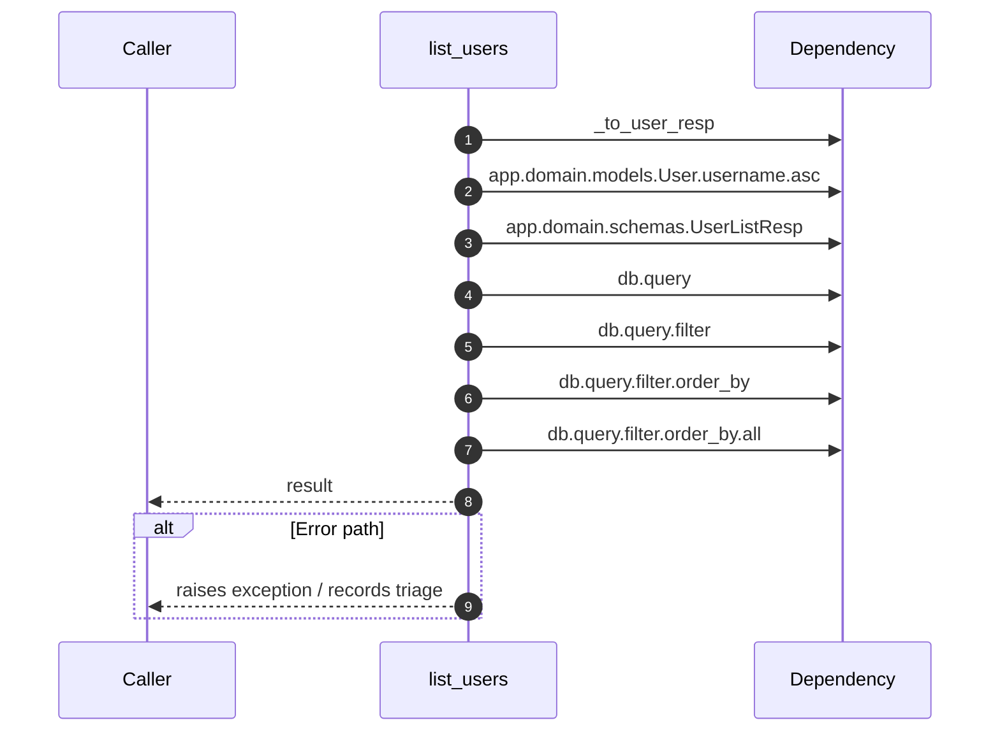

# Internal flow — `app.ports.users.list_users`

- Module: `app.ports.users`
- Source: [app.ports.users.list_users](../Src/backend/app/ports/users.py#L20)
- Summary: Return all users for the given tenant ordered by username.

