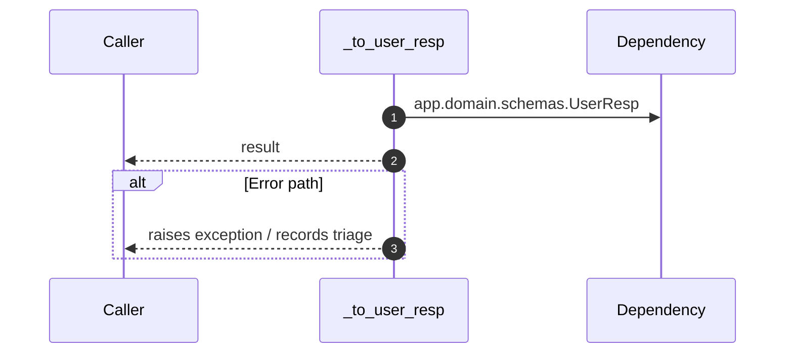

# Internal flow — `app.ports.users._to_user_resp`

- Module: `app.ports.users`
- Source: [app.ports.users._to_user_resp](../Src/backend/app/ports/users.py#L16)

```mermaid
sequenceDiagram
    autonumber
    participant Caller
    participant Target as _to_user_resp
    Target->>Dependency: app.domain.schemas.UserResp
    Target-->>Caller: result
    alt Error path
        Target-->>Caller: raises exception / records triage
    end
```