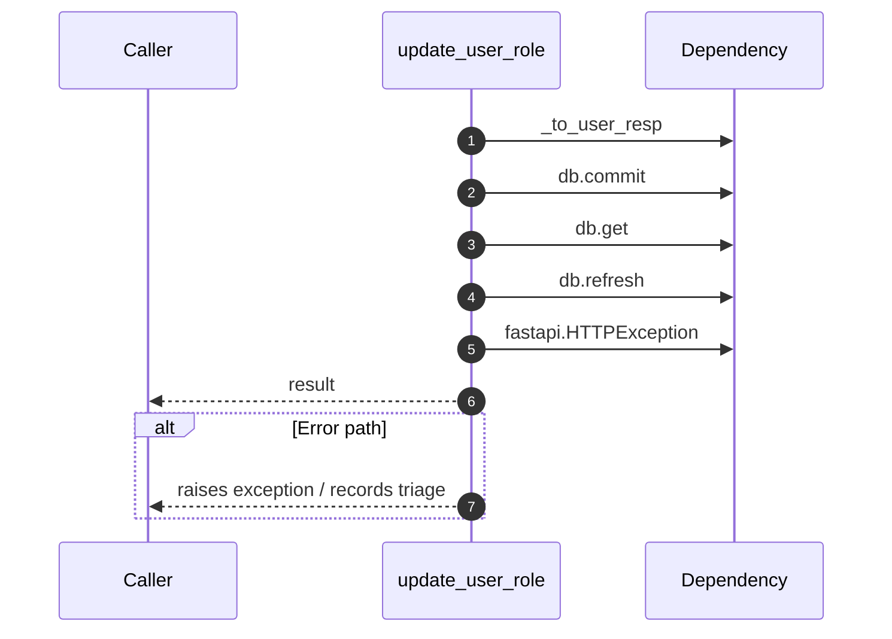

# Internal flow — `app.ports.users.update_user_role`

- Module: `app.ports.users`
- Source: [app.ports.users.update_user_role](../Src/backend/app/ports/users.py#L29)
- Summary: Update the role for a user within the same tenant.

