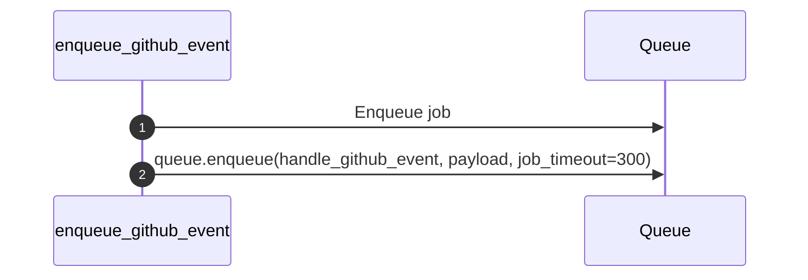

# Sequence: Job enqueue_github_event

**Source:** [`job_queue.py`](../../Src/backend/worker/job_queue.py#L39)

```mermaid
sequenceDiagram
    autonumber
    participant API as enqueue_github_event
    participant Queue as Queue
    API->>Queue: Enqueue job
    API->>Queue: queue.enqueue(handle_github_event, payload, job_timeout=300)
```
